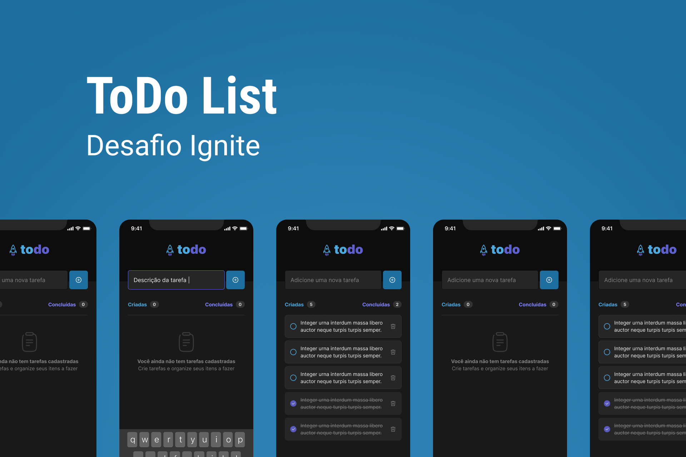

<h1 align="center">
  
</h1>

## 💻 Projeto

Essa aplicação é um resultado de um protótipo desse <a href="https://www.figma.com/file/ErEKK7odFAdrTa8FBdvg52/ToDo-List-(Copy)?node-id=56%3A96&t=HlWpcjfAYMp9jDtC-0">link</a>, no desafio feito no curso Ignite, da @Rocketseat, com intuito de colocar em práticas conceitos básicos sobre o desenvolvimento de um app mobile com React Native. A aplicação é um simples gerenciador de tarefas, com possibilidade de adicionar grandes listas de tarefas, e poder quantificar quantidade vs tarefas concluídas.
<br>
<br>

## 📄 Pré-requisitos

- [x] NodeJS >= 16.0
- [x] yarn

## Executando o projeto
<br>

Instale as dependências com o comando **yarn** em seu terminal.
```cl
yarn
```
Após a instalação das dependências, basta executar o app com o comando:
```cl
npx expo start
```

<br>

### Executando em Expo Go

<br>

Em seu terminal, com o App ExpoGo instalado em seu device, escaneie o QR Code apresentado em seu terminal para seu app executar.

<br>

### Executando em emulador Android

<br>

Em seu terminal, após executar projeto com **npx expo start**, aguarde o QRCode ser gerado em seu terminal, e logo em seguida, pressione a tecla **a**, e a aplicação abrirá em seu emulador criado no Android Studio.